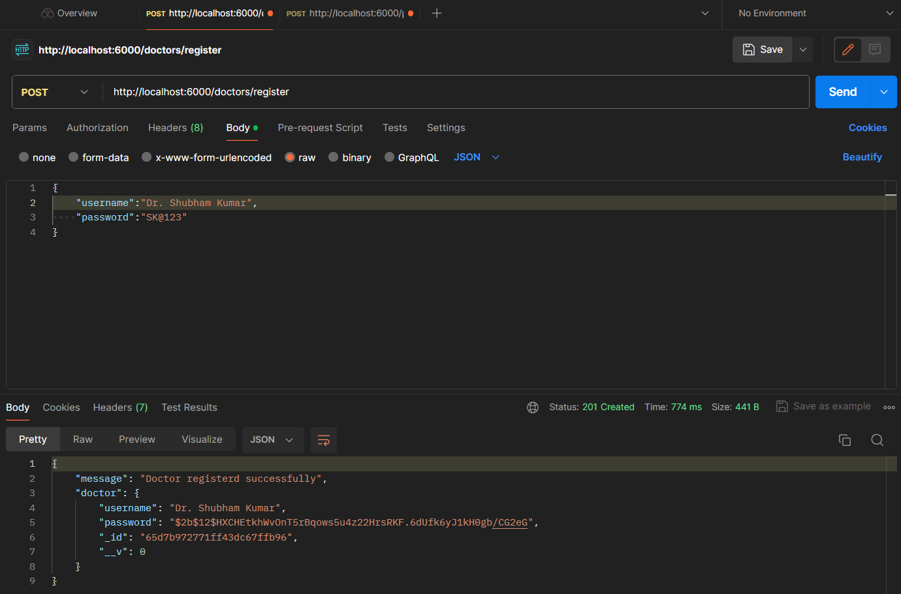
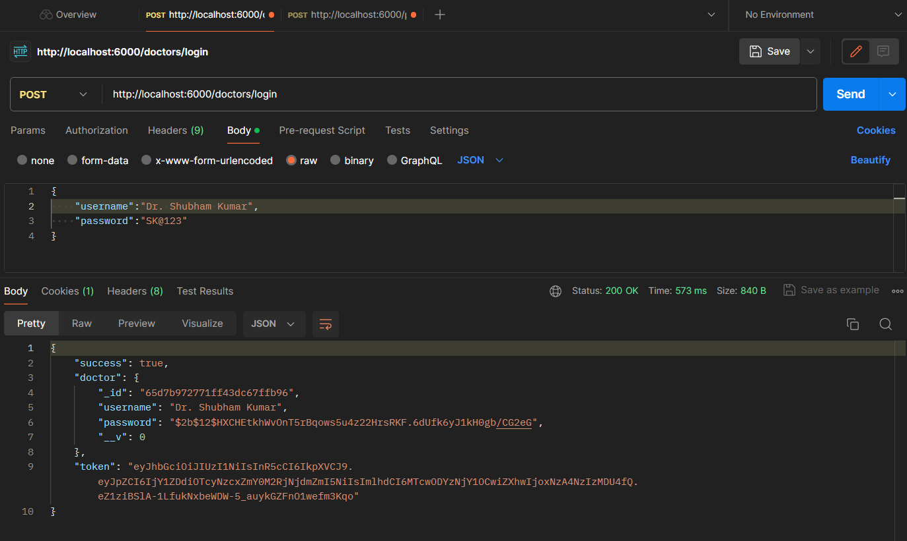
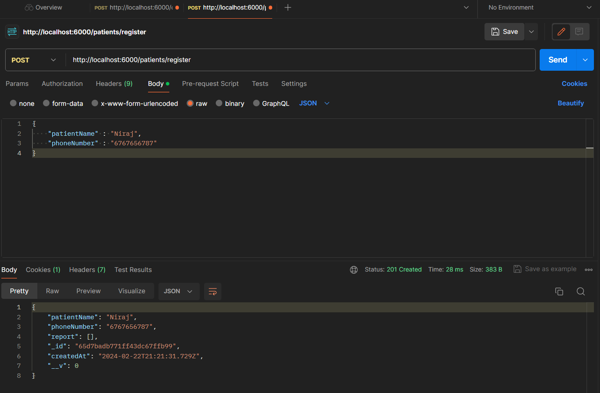
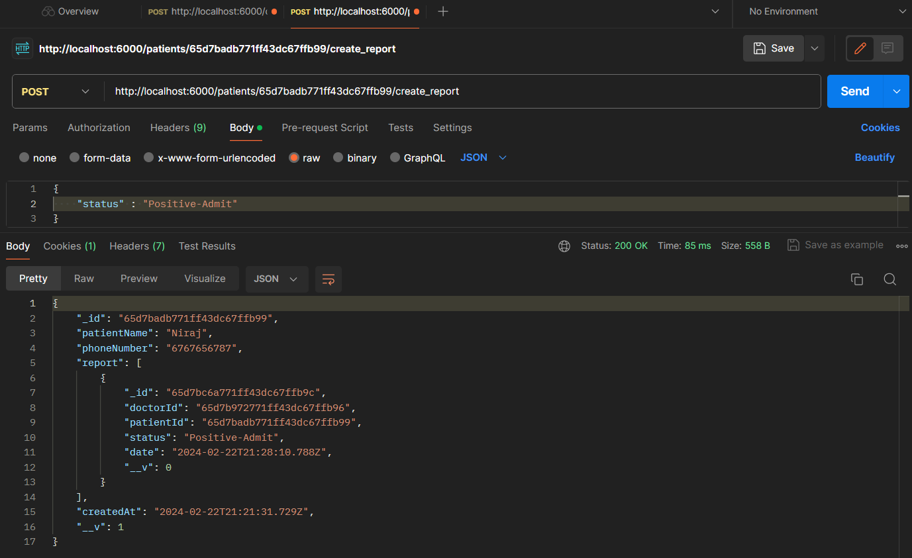
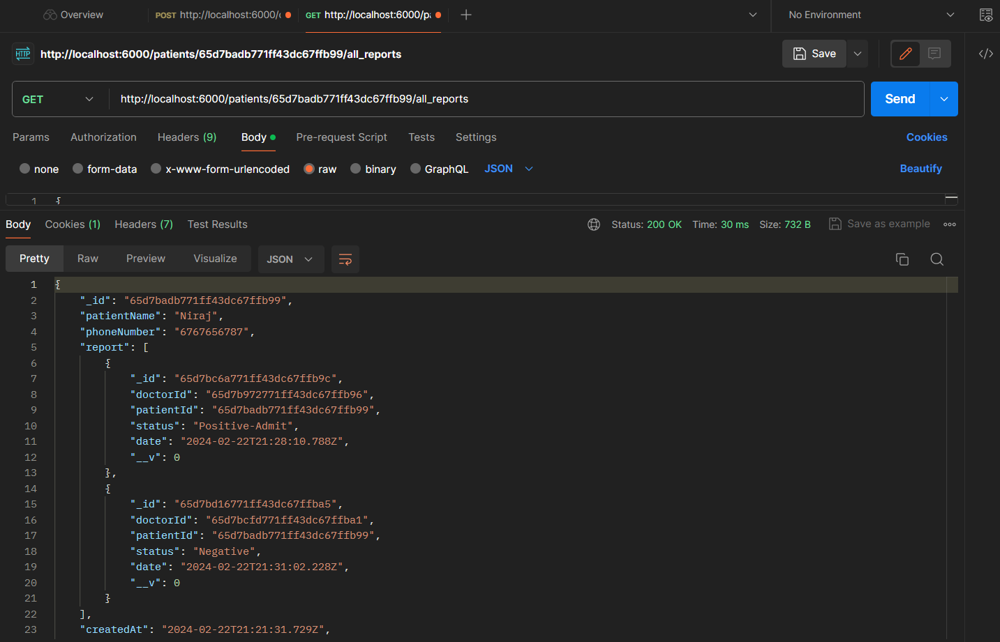
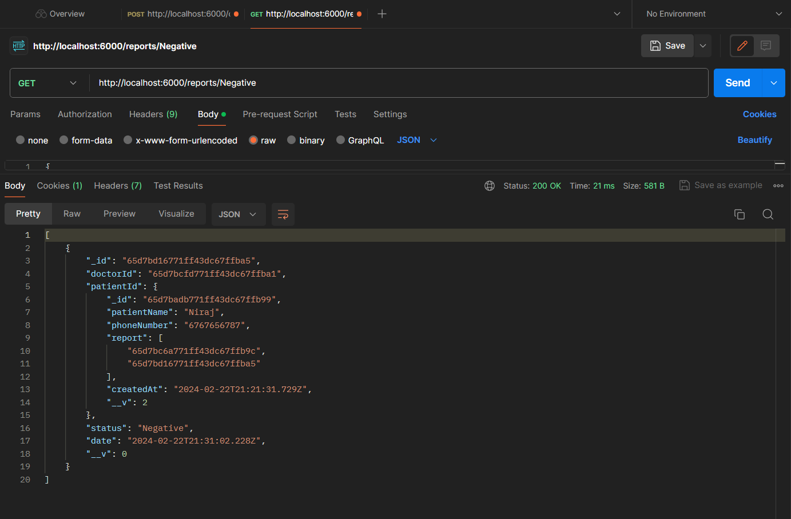

# Hospital API

This API is designed to facilitate doctors working in a hospital designated by the government for COVID-19 patient testing, quarantine, and well-being management. It provides essential functionalities to manage patient data, track test results, allocate quarantine facilities, and ensure the overall health and safety of COVID-19 patients.

## Features

- **Authentication**: Secure authentication system for doctors.
- **Authorization**: Role-based access control for managing resources.
- **CRUD Operations**: Create, read, update, and delete operations for hospitals, doctors, and patients.
- **Relationships**: Establish relationships between hospitals, doctors, and patients.
- **Search**: Search functionality to find hospitals, doctors, and patients by various criteria.
- **Pagination**: Paginated responses for better performance.
- **Error Handling**: Proper error handling and response messages.

## Technologies Used

- **Node.js**: JavaScript runtime environment.
- **Express.js**: Web application framework for Node.js.
- **MongoDB**: NoSQL database for storing hospital, doctor, and patient data.
- **Mongoose**: MongoDB object modeling tool for Node.js.
- **JWT**: JSON Web Tokens for secure authentication.
- **Bcrypt**: Library for hashing passwords securely.

## Installation

1. Clone the repository:

    ```bash
    git clone https://github.com/888Shubham/Hospital_API.git
    ```

2. Install dependencies:

    ```bash
    cd Hospital_API
    npm install
    ```

3. Set up environment variables:

    Create a `.env` file in the root directory and add the following variables:

    ```plaintext
    PORT=6000
    MONGODB_URI=your_mongodb_uri
    JWT_SECRET=your_jwt_secret
    ```

4. Start the server:

    ```bash
    npm start
    ```

## API Documentation


The API documentation is available using Swagger UI. After starting the server, navigate to `http://localhost:3000/api-docs` in your browser to view the API documentation and test the endpoints.

### Routes

#### Hospitals

- ** `http://localhost:3000/doctors - for Doctor
- ** `http://localhost:3000 - for Pateint

#### Doctors

- **POST /register: Create a new doctor.
- **POST /login: Doctor login.
- **POST /logout: Doctor Logout.


#### Patients

- **Post /patients/register: Get a specific patient by ID
- **Post /patients/:id/create_report: Create a Report for a Given Patient
- **Get /patients/:id/all_reports: Get all report for a given Patient.
- **Get /reports/:status: Get all report of all Patients by status

## Contributing

Contributions are welcome! Please create a new branch for your changes and submit a pull request for review.


##Screenshots








